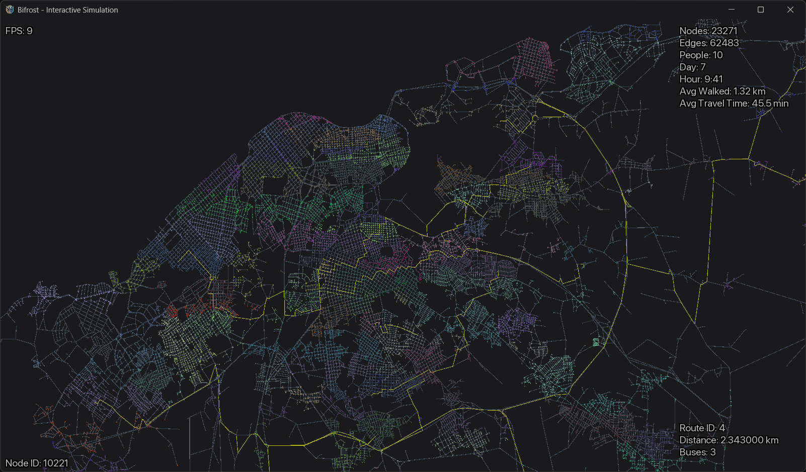

# Bifrost Simulation
Agent Based Simulation to optimize routes in public transportation from scratch in C++

### To-do:

Fase 1:
 - Visualization
 - Multi Source Shortest Path for CRP
 - - Dinic
 - - [Inertial Flow](http://sommer.jp/roadseparator.htm) (DOI: 10.1007/978-3-319-20086)
 - - [Multi Level Dijkstra](https://pure.tudelft.nl/ws/portalfiles/portal/68248386/Multilayer.pdf) (DOI: 10.1016/j.comcom.2008.09.026)
 - Extend graph with routes  

Fase 2:
 - Simulation Backbone
 - Add Agent Behaviour
 - New Route Needed Metaheuristic
 - Optimal Route Planner
 - Multiple Simulation Optimizer

Fase 3:
 - Optimize Visualization
 - Use Cuda for Agents