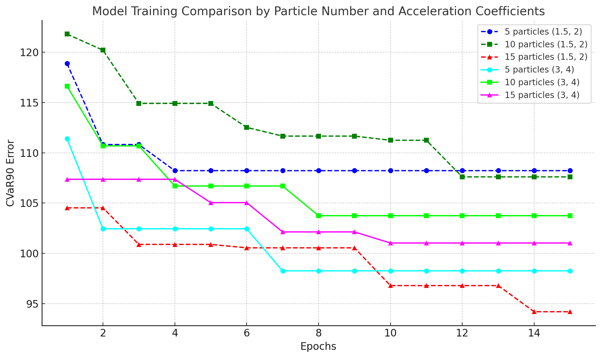

# Bifrost: Agent-Based Public Transportation Optimization

**Abstract**

This paper presents Bifrost, a simulation project aimed at optimizing public transportation in a city using a multi-agent approach. Bifrost simulates agents representing travelers, modeled with the Belief-Desire-Intention (BDI) architecture, and utilizes Particle Swarm Optimization (PSO) to minimize Conditional Value at Risk at the 90th percentile (CVaR90) of travel times. The simulation is designed to assess and improve the efficiency of public transport systems by modeling real-world behaviors and optimizing the transportation network.

**Introduction**

Efficient public transportation is essential for reducing congestion, minimizing emissions, and improving urban quality of life. Bifrost is a simulation-based approach to evaluate and optimize public transport efficiency by simulating agents in a city using the BDI framework. The agents represent travelers making transportation decisions in an environment consisting of various modes of transit. The optimization goal focuses on reducing the CVaR90 of agent travel times using PSO, which helps to improve both average travel times and reliability. For experimental purposes, we used the map of Havana, Cuba.

**Problem Statement**

The problem involves optimizing public transportation in a city represented as a map, with a set of routes serviced by buses and individuals who need to move throughout the city. The challenge is to find an optimal set of bus routes that minimizes a cost function, specifically focusing on minimizing travel times while ensuring reliability. The reliability is measured by the CVaR90 metric, which reflects the worst-case travel scenarios. This requires understanding individual behaviors and optimizing the routes to achieve an efficient and dependable transportation network.

**Problem Modelation**

1. **Graph Modelation**

   The city is represented as a graph, where intersections of streets are nodes and edges are the streets. In the graph containing buses, the representation is similar, but for each bus stop, a new node is created, and edges are added between bus stops with less cost than walking. Additionally, a directed edge is added from the regular nodes to the bus stop nodes to represent the approximate time to wait for a bus, and another directed edge with zero cost is added in the opposite direction to represent leaving a bus. This 'walking + bus' representation only occurs in the beliefs of the agents (further details are provided later).

2. **Route Modelation**

   Routes are sets of nodes, which represent the bus stops. Each bus travels using the shortest distance between stops, and for each route, there is an assigned number of buses.

3. **Agents Modelation**

   The agents in the simulation are based on the BDI architecture, which allows them to make decisions in a way that mimics human behavior.

   - **Beliefs**: Our agents' beliefs are the knowledge about the buses in the city, more specifically the time they have to wait at a specific bus stop, and the time a bus takes to go from one bus stop to another. More formally, the beliefs of our agents are represented as a graph, containing the time to go from one node to another in minutes, essentially the graph of the city but with distances represented as the time it takes for that specific person to walk. Additionally, more nodes are added, one for each bus stop for each route, which is connected to the original graph node via two directed edges. One edge represents the time the person believes they have to wait, and the other is zero (representing the time needed to leave the bus). There are also weights between stops, indicating the time it takes for the bus to travel from one stop to another.

   - **Desires**: The agent's desires represent their ultimate goals, such as reaching a destination in the shortest possible time, minimizing travel cost, or maximizing convenience. These desires are influenced by the agent's beliefs and personal attributes. For example, an agent with limited financial resources may prioritize minimizing cost, while an agent in good physical condition may be more inclined to walk if the distance is reasonable.

   - **Intentions**: Intentions in our project are the specific actions that agents decide to take in order to achieve their desires. Based on their beliefs and using fuzzy logic to account for uncertainties, agents may intend to either walk or take a bus. For example, if an agent perceives that the bus delay is too long, they may intend to walk to their destination. Conversely, if the distance is far and the agent believes their physical state is weak, they will intend to take a bus. These intentions are influenced by the agent's attributes and the current environment, guiding the agent's behavior in the simulation.

   - **Fuzzy Logic**: Given the beliefs of a person, we use fuzzy logic to decide which action to take, such as whether to take a bus or walk. Each agent has unique attributes, including:

     - **Distance**: Represents the distance to be traveled, categorized as 'Close', 'Medium', or 'Far'.
     - **Bus Delay**: The expected delay for a bus, categorized as 'Short', 'Medium', or 'Long'.
     - **Physical State**: Represents the physical fitness of the agent, categorized as 'Weak', 'Average', or 'Strong'.
     - **Money**: Represents the agent's financial state, categorized as 'Low', 'Medium', or 'High'.
     - **Decision**: Represents the final action that the agent takes, which can be 'Walk' or 'Bus'.

     The fuzzy rules used in the decision-making process are as follows:

     - If **Distance** is 'Far' and **Physical State** is 'Weak', then **Decision** is 'Bus'.
     - If **Money** is 'Low', then **Decision** is 'Walk'.
     - If **Bus Delay** is 'Long', then **Decision** is 'Walk'.
     - If **Physical State** is 'Strong' and **Distance** is 'Close', then **Decision** is 'Walk'.
     - If **Distance** is 'Medium' and **Physical State** is 'Average', then **Decision** is 'Walk'.
     - If **Money** is 'High', then **Decision** is 'Bus'.

     These fuzzy rules, defined in the fuzzy logic engine, help agents make decisions based on their attributes and beliefs about the environment. For example, if an agent perceives the distance to be far and their physical state to be weak, they are more likely to choose taking a bus. Conversely, if they perceive a long bus delay, they may opt to walk.

       

**Optimization**

1. **Simulation**

   The simulation takes place over several days (usually 7). At the start of the simulation, agents have beliefs about the waiting times for each bus and the time buses take between stops—very basic and general knowledge. Each day, the agents move around the city, and at the end of the day, based on their experience with the buses they took, they update their beliefs with what they learned.

   The movement of agents through the city is an event-based simulation, where there are two basic entities: the people and the buses. The buses follow given routes and move in cycles through their respective stops. The people, on the other hand, decide where they want to go and, based on their beliefs, plan the best route and take it. They board the bus when it arrives and get off when they reach their destination stop. A person may take more than one bus if necessary. This simulation involves the following events defined in the code:

   - **PERSON\_START\_WALKING**: An agent starts walking towards a bus stop or destination.
   - **PERSON\_ARRIVE\_STOP**: An agent arrives at a bus stop and waits for a bus.
   - **BUS\_ARRIVE\_STOP**: A bus arrives at a stop, allowing agents to board or disembark.
   - **PERSON\_GET\_OFF\_BUS**: An agent gets off a bus at their desired stop.
   - **PERSON\_ARRIVE\_WORK**: An agent reaches their final destination, such as work or another point of interest.

   At the end of each day, the agents record the bus delay times and the times between stops and average them with the previously known times, except for the first day, where they simply keep the newly gained knowledge (as if they had never taken that bus before).

  

1. **Error Metric**

   The primary metric used for optimization is CVaR90, which measures the Conditional Value at Risk at the 90th percentile. Specifically, it represents the average of the worst 10% of travel times. This metric was chosen because it not only considers average performance but also focuses on the tail end of the distribution, ensuring that the most problematic travel scenarios are addressed. By minimizing CVaR90, we aim to provide a more reliable transportation system that performs well even in the worst-case situations, improving both efficiency and user satisfaction.

2. **PSO**

   Particle Swarm Optimization (PSO) is an optimization algorithm inspired by the social behavior of birds flocking or fish schooling. In our project, PSO is used to optimize the bus routes to minimize the CVaR90 metric of travel times. PSO works by initializing a swarm of particles, where each particle represents a potential solution (i.e., a set of routes). These particles move through the solution space, adjusting their positions based on their own experience and the experience of neighboring particles to find the optimal solution.

   For each route in our simulation, we used 5 intermediate points to optimize the path, with the remaining stops being positioned along the shortest path between these intermediate points. This approach allows us to maintain flexibility in route design while avoiding overly simplistic solutions. In earlier experiments, we used only two intermediate points, which resulted in less effective optimization. In real-world settings, bus routes often do not follow the shortest path between two points, as they need to service multiple stops to meet demand. By using more intermediate points, we allow routes to diverge from the shortest path where necessary, leading to a more realistic and efficient public transportation system.

**Experiments**

     

**Further Work**
Future improvements to Bifrost include:

- Exploring other optimization algorithms beyond PSO.
- Adding schedules to bus routes.
- Optimizing the project to simulate a greater number of agents, potentially using parallelization with GPUs.
- Using more realistic data for agents' geographical dispersion.
- Modeling the problem in a more flexible way to allow modifications to the number of buses per route during optimization.
- Minimizing additional variables, such as fuel consumption or traffic congestion.

**Conclusions**

Bifrost demonstrates a novel approach to optimizing public transportation through agent-based simulation and Particle Swarm Optimization (PSO). By focusing on minimizing CVaR90, the model addresses not only the average travel times but also the worst-case scenarios, ensuring that the transportation system is both efficient and reliable. This approach makes it possible to create a balanced network that serves the needs of different users effectively, particularly those affected by delays and less optimal conditions. Moreover, this project could have significant applications in real-world traffic optimization, offering insights into how public transit systems can be made more efficient and reliable, ultimately improving urban mobility and reducing congestion.

