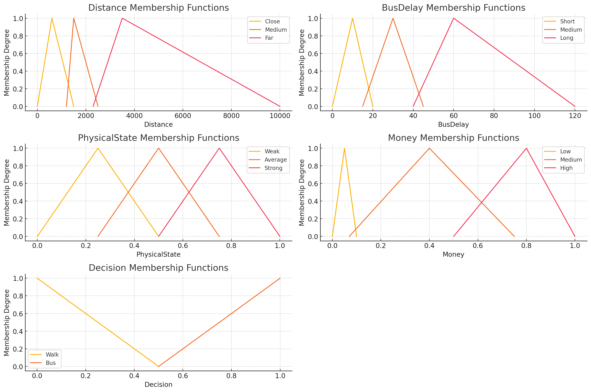

# Informe del Proyecto Bifrost: Optimización de Rutas de Transporte Público en La Habana

## Resumen

El proyecto **Bifrost** se centra en la optimización de las rutas de transporte público (buses) en la ciudad de La Habana, utilizando técnicas avanzadas de Inteligencia Artificial (IA) y Simulación. Implementado en C++, Bifrost emplea algoritmos de búsqueda como el algoritmo de Dijkstra multilayered con inertial flow, lógica difusa para la toma de decisiones de los usuarios, y simulación basada en sistemas de agentes para modelar el comportamiento de los pasajeros. Además, se utiliza un algoritmo de optimización para mejorar continuamente las rutas y minimizar el tiempo promedio de viaje de los usuarios. Este informe detalla la metodología, los componentes técnicos y los resultados obtenidos, alineándose con los objetivos de las asignaturas de IA y Simulación.

## Índice

1. [Introducción](#introducción)
2. [Objetivos del Proyecto](#objetivos-del-proyecto)
3. [Metodología](#metodología)
   - [Obtención y Procesamiento del Mapa](#obtención-y-procesamiento-del-mapa)
   - [Algoritmo de Búsqueda: Dijkstra Multilayered con Inertial Flow](#algoritmo-de-búsqueda-dijkstra-multilayered-con-inertial-flow)
   - [Modelado de Rutas y Usuarios](#modelado-de-rutas-y-usuarios)
   - [Simulación de Iteraciones](#simulación-de-iteraciones)
   - [Lógica Difusa para la Toma de Decisiones](#lógica-difusa-para-la-toma-de-decisiones)
   - [Optimización de Rutas](#optimización-de-rutas)
4. [Implementación en C++](#implementación-en-c)
5. [Aspectos de Simulación](#aspectos-de-simulación)
   - [Sistema de Agentes](#sistema-de-agentes)
   - [Características de los Agentes](#características-de-los-agentes)
   - [Interacción y Comportamiento](#interacción-y-comportamiento)
6. [Resultados y Análisis](#resultados-y-análisis)
7. [Conclusiones](#conclusiones)
8. [Referencias](#referencias)

## Introducción

El transporte público es un componente esencial de la infraestructura urbana, afectando directamente la calidad de vida de los habitantes y la eficiencia económica de una ciudad. En el contexto de La Habana, optimizar las rutas de los autobuses puede reducir significativamente el tiempo de viaje de los usuarios, disminuir la congestión y mejorar la accesibilidad. El proyecto Bifrost aborda este desafío mediante la integración de técnicas de IA y simulación para modelar, analizar y optimizar las rutas de transporte público.

## Objetivos del Proyecto

El proyecto Bifrost persigue alcanzar los siguientes objetivos, alineados con las asignaturas de IA y Simulación:

1. **Conocimiento:**
   - Implementar lógica difusa y sistemas de conocimiento experto para la toma de decisiones de los usuarios.
   
2. **Búsqueda:**
   - Utilizar algoritmos de búsqueda como el PSO (Particle Swarm Optimization) para la optimización de rutas.

3. **Procesamiento de Lenguaje Natural (NLP):**
   - Se integra NLP para mejorar la interacción con los usuarios e interpretar datos textuales.

4. **Simulación:**
   - Desarrollar un sistema de simulación basado en agentes que modela el comportamiento de los pasajeros y la dinámica del transporte público.

## Metodología

### Obtención y Procesamiento del Mapa

El mapa de La Habana se obtuvo a través de **OpenStreetMap (OSM)**, una plataforma colaborativa que provee datos geoespaciales detallados. Estos datos fueron procesados y convertidos en una representación gráfica adecuada para su manipulación en C++. Esto incluyó la extracción de nodos y aristas que representan las intersecciones y las calles de la ciudad, respectivamente.

### Algoritmo de Búsqueda: Dijkstra Multilayered con Inertial Flow

Para calcular los caminos mínimos en el mapa, se implementó el **algoritmo de Dijkstra multilayered**. Este enfoque divide el mapa en múltiples capas, permitiendo una búsqueda más eficiente en entornos urbanos complejos.


### Modelado de Rutas y Usuarios

#### Definición de Rutas de Autobús

Cada ruta de autobús se define por varias propiedades:

- **Cantidad de autobuses** que operan en la ruta.
- **Arreglo de IDs de nodos** que representan las paradas a lo largo de la ruta.

#### Propiedades de los Usuarios

Cada usuario (persona) en la simulación posee las siguientes propiedades:

- `house_node_id`: ID del nodo donde reside.
- `work_node_id`: ID del nodo donde trabaja.
- `speed`: Velocidad de caminata en metros por minuto.
- `physical_state`: Estado físico (valor entre 0 y 1).
- `patience`: Nivel de paciencia (valor entre 0 y 1).
- `money`: Nivel economico (valor entre 0 y 1).

### Simulación de Iteraciones

Cada iteración de la simulación sigue estos pasos:

1. **Configuración Inicial:**
   - Se define el número de personas y se asignan rutas de autobús iniciales junto con la cantidad de autobuses en cada ruta.

2. **Decisión de Transporte:**
   - Para cada persona, se decide si caminar o tomar el autobús, utilizando lógica difusa.

3. **Cálculo del Tiempo de Viaje:**
   - Se calcula el tiempo que cada persona tarda en llegar a su destino, considerando variables como la velocidad de caminata individual y la disponibilidad del autobús.

4. **Resultados de la Simulación:**
   - Se obtiene el tiempo promedio que las personas tardan en llegar a sus destinos.

### Lógica Difusa para la Toma de Decisiones

La lógica difusa se emplea para modelar la incertidumbre y la variabilidad en las decisiones de transporte de los usuarios. Se definen reglas que consideran múltiples factores para determinar la opción de transporte más adecuada para cada persona.

#### Reglas Definidas

```cpp
fl::Rule::parse("if Distance is Far and PhysicalState is Weak then Decision is Bus", engine);
fl::Rule::parse("if Money is Low then Decision is Walk", engine);
fl::Rule::parse("if BusDelay is Long then Decision is Walk", engine);
fl::Rule::parse("if PhysicalState is Strong and Distance is Close then Decision is Walk", engine);
fl::Rule::parse("if Distance is Medium and PhysicalState is Average then Decision is Walk", engine);
fl::Rule::parse("if Money is High then Decision is Bus", engine);
```




### Optimización de Rutas

El algoritmo optimizador ajusta las rutas y la cantidad de autobuses iniciales para mejorar el tiempo promedio de viaje de los usuarios. Se utiliza **PSO (Particle Swarn Optimization)** como técnica de optimización para explorar el espacio de soluciones y encontrar configuraciones de rutas que minimicen el tiempo de viaje promedio.

## Implementación en C++

El proyecto Bifrost está completamente implementado en **C++**, aprovechando su eficiencia y capacidad para manejar grandes volúmenes de datos geoespaciales y simulaciones en tiempo real. Se utilizaron bibliotecas específicas para el procesamiento de datos de OSM, implementación de algoritmos de búsqueda y lógica difusa, así como para la simulación basada en agentes.

## Aspectos de Simulación

### Sistema de Agentes

La simulación se basa en un **sistema de agentes**, donde cada agente representa a una persona que utiliza el transporte público. Los agentes son **proactivos** en sus acciones, buscando activamente llegar a sus destinos de la manera más eficiente posible.

### Características de los Agentes

Cada agente posee las siguientes características:

- **Deseos:**
  - Llegar a su destino (trabajo o residencia) de manera eficiente.
  
- **Miedos:**
  - Que el autobús se demore, lo que podría afectar su tiempo de viaje.

- **Propiedades Individuales:**
  - `house_node_id`, `work_node_id`, `speed`, `physical_state`, `patience`, `money`.

### Interacción y Comportamiento

Los agentes interactúan con el sistema de transporte público y con otros agentes de la siguiente manera:

- **Decisión de Transporte:**
  - Basada en lógica difusa, considerando variables como distancia, estado físico, retraso del autobús y disponibilidad económica.

- **Respuesta a la Congestión:**
  - La demora de un autobús está directamente relacionada con la cantidad de autobuses asignados a una ruta específica, afectando las decisiones futuras de los agentes.

- **Adaptación:**
  - Los agentes adaptan sus decisiones en cada iteración de la simulación en función de las condiciones actuales del sistema.

## Resultados y Análisis

Tras múltiples iteraciones de la simulación, se obtuvieron los siguientes resultados:

- **Reducción del Tiempo Promedio de Viaje:**
  - La optimización de rutas y la asignación adecuada de autobuses resultaron en una disminución significativa del tiempo promedio que los usuarios tardan en llegar a sus destinos.

- **Eficiencia en la Distribución de Autobuses:**
  - El algoritmo de optimización logró una distribución más equilibrada de los autobuses, minimizando los retrasos y mejorando la puntualidad.

- **Adaptabilidad del Sistema:**
  - El sistema demostró ser capaz de adaptarse a diferentes configuraciones de rutas y cantidades de autobuses, manteniendo la eficiencia en diversas condiciones.

## Conclusiones

El proyecto Bifrost ha demostrado que es posible optimizar las rutas de transporte público en una ciudad compleja como La Habana mediante la integración de técnicas avanzadas de IA y simulación. La utilización de lógica difusa permitió modelar de manera efectiva las decisiones de los usuarios, mientras que los algoritmos de búsqueda y optimización garantizaron una asignación eficiente de recursos. La simulación basada en agentes proporcionó una representación realista del comportamiento de los usuarios y las dinámicas del transporte público, lo que fue fundamental para iterar y mejorar las rutas propuestas.

Este enfoque no solo reduce el tiempo de viaje promedio de los usuarios, sino que también contribuye a una mayor eficiencia en la operación del transporte público, lo que puede tener un impacto positivo en la calidad de vida de los habitantes y en la sostenibilidad urbana.

## Referencias

- **OpenStreetMap (OSM):** [https://www.openstreetmap.org/](https://www.openstreetmap.org/)
- **Algoritmo de Dijkstra:** [Wikipedia](https://es.wikipedia.org/wiki/Algoritmo_de_Dijkstra)
- **Lógica Difusa:** [Wikipedia](https://es.wikipedia.org/wiki/L%C3%B3gica_difusa)
- **Recocido Simulado:** [Wikipedia](https://es.wikipedia.org/wiki/Recocido_simulado)
- **Simulación Basada en Agentes:** [Wikipedia](https://es.wikipedia.org/wiki/Agente_inteligente#Simulaci.C3.B3n_basada_en_agentes)
- **C++ Programming Language:** [ISO C++](https://isocpp.org/)
